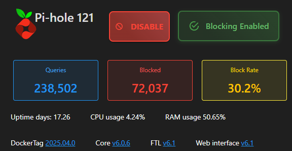

# Pi-hole Multi-Instance Control Dashboard <!-- omit in toc -->

## 📖 Table of Contents <!-- omit in toc -->

- [✨ Features](#-features)
- [🚀 Getting Started](#-getting-started)
  - [Prerequisites](#prerequisites)
  - [Configuration](#configuration)
- [💡 UI Overview](#-ui-overview)
- [🧩 Styling](#-styling)
- [🔐 Authentication](#-authentication)
- [🧪 Tested On](#-tested-on)
- [📸 Screenshots](#-screenshots)
- [📁 Files](#-files)
- [📜 License](#-license)
- [🙋‍♂️ Contributions](#️-contributions)

## ✨ Features

- 🔄 Enable/Disable all Pi-holes at once (with optional timer for disables via modal dialog)
- 🔧 Individual Pi-hole enable/disable with timed disable option (modal input)
- 📊 Display aggregated stats across all Pi-holes:
  - Total queries (sum)
  - Total blocked (sum)
  - Block percentage (calculated from totals)
  - Total domains blocked (from a single Pi-Hole only)
- 🧑‍💻 Direct links to Pi-hole web interfaces
- 🖼️ Pi-hole icon loaded from a public GitHub SVG URL
- 🆕 Display version info for Docker, Core, FTL, and Web for each Pi-hole, with clickable links to their releases
- ⚙️ Responsive buttons with custom styles (green, red, blue, yellow)
- 🔄 "Refresh All" button to refresh details

## 🚀 Getting Started

### Prerequisites

- PowerShell Universal v5.5.2 (Free version tested)
- [`PoshPiHole`](https://github.com/ptmorris1/PoshPiHole) module installed
- Access to your Pi-hole servers via HTTP (API enabled)
- [At least 1 Pi-Hole](https://pi-hole.net/)

### Configuration

1. **Install the module from the PSU module gallery**  
   In the PowerShell Universal admin interface, go to the Modules page. Change the search drop-down to "PowerShell Gallery", search for "PoshPiHole", and click the Install button. Modules installed this way will be saved to the Repository directory under Modules.

2. **Download the `pihole.ps1` dashboard file**  
   Obtain the latest `pihole.ps1` from this repository.

3. **Set Pi-hole URLs**  
   Update the `$piholes` array with the URLs of your Pi-hole instances:

   ```powershell
   $piholes = @(
       'http://192.168.1.121',
       'http://192.168.1.176',
       'http://192.168.1.126'
   )
   ```

4. **Set your Pi-hole icon URL (optional)**  
   ```powershell
   $PiHoleImage = "https://github.com/homarr-labs/dashboard-icons/tree/main/svg/pi-hole.svg"
   ```

5. **Add the page to your PSU app**  
   Either add the downloaded `pihole.ps1` as a page to an existing PowerShell Universal App, or create a new App and add the page.

6. **Create a secret called 'pihole' with your Pi-hole password**  
   This is used as `$Secret:pihole` for your Pi-hole credentials (stored via PowerShell Universal's Secret Management).

7. **Launch the dashboard**  
   Use your existing PSU dashboard framework or create a new one and paste in the provided dashboard code.

## 💡 UI Overview

| Button            | Description                                   |
|-------------------|-----------------------------------------------|
| Enable All        | Enables blocking on all configured Pi-holes   |
| Disable All       | Disables blocking on all configured Pi-holes (optionally for a set time) |
| Refresh All       | Refreshes the current status and statistics, shows a modal for 2 seconds |
| Enable/Disable    | Toggle individual Pi-hole blocking state (with optional timer for disables) |

## 🧩 Styling

The app uses custom CSS classes (`button-blue`, `button-red`, `button-yellow`, `button-green`) for a modern, elevated look and intuitive color-based state cues.

## 🔐 Authentication

All Pi-hole API calls use the `$Secret:pihole` credential object. Make sure this is securely stored in PSU's Secret Store.

## 🧪 Tested On

- PowerShell Universal v5.5.2 (Free)
- Multiple Pi-hole v6.x instances

## 📸 Screenshots




> _You can add screenshots here to illustrate the dashboard UI._

## 📁 Files

- Dashboard source (see `pihole.ps1`)
- Styles included inline in the dashboard script
- Icon loaded from a public GitHub SVG URL but can be hosted locally.

---

## 📜 License

This app is licensed under the GNU General Public License v3.0 (GPLv3), Version 3, 29 June 2007.
See [LICENSE](https://www.gnu.org/licenses/gpl-3.0.html) for details.

---

## 🙋‍♂️ Contributions

Pull requests and improvements welcome. Feel free to fork and extend!